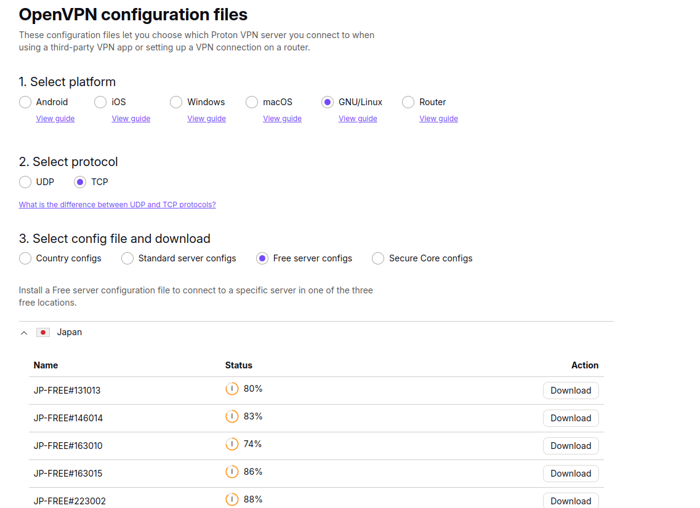

# How to use the `sirup` package to manage your IP address in python

When scraping data from the internet, you can protect your privacy by performing your requests with different IP addresses. One way to do this is by rotating your IP address through a VPN service. [Here](https://azure.microsoft.com/en-us/resources/cloud-computing-dictionary/what-is-vpn#:~:text=A%20VPN%2C%20which%20stands%20for,and%20firewalls%20on%20the%20internet.) you can read more about what a VPN service is --- in short, the service has a bunch of remote servers, and connecting your computer to one of these servers changes your IP address. 

If you are using python on a linux operating system, you can use the `sirup` package to flexibly change your IP address. This tutorial explains how to set it up.

**Note**
When using IP rotation for webscraping, it is important to respect the law, and for instance only access information that is publicly available. Also, do not send too many requests to the target website in a given time. 

## What you need 

### 1. `openvpn`

[OpenVPN](https://en.wikipedia.org/wiki/OpenVPN) is a system that allows you to create secure VPN connections. You can install it by following [these instructions](https://community.openvpn.net/openvpn/wiki/OpenvpnSoftwareRepos).


### 2. Root access to your computer

Because internet connections are an important security concern, `OpenVPN` requires root access -- this is the equivalent to administrator rights on a windows computer. If you have root access, you can for instance run the following command on your terminal:

```bash
sudo ls -lh # will ask you for your root password
``` 


## Installing and setting up `sirup`

You can install `sirup` as follows:

```python
python -m pip install sirup
```

To use the package and change your IP address, you need an account with a VPN service provider that offers OpenVPN configuration files for your account. At the time of writing, for instance ProtonVPN and Surfshark offer this option. (Note that these services are not for free.) We will use ProtonVPN in this tutorial.

After creating an account, you need to download two sets of files. 

First, you download credentials that identify your Proton account when using OpenVPN. On the ProtonVPN website, click on "Account" and then you see something like this:


Copy and paste the username and the password into a `txt` file that looks like this:

```txt
username
password
```

Then, save the file as "proton_credentials.txt". Remember where it is stored -- we will need it later.

Second, we need configuration files, whose names end with `.ovpn`. The files allow OpenVPN to connect to a server from the VPN service provider. In ProtonVPN, go to the "Download" section of your account. Select the options as follows:




And download the configuration file(s) you want to use. Store the downloaded files on your computer, and remember the location. 

Now you are ready!


## Using `sirup`

We start by defining the path to the `proton_credentials.txt` file. When you execute the code below, you will be asked to enter the root password, which is necessary to make the connection.


```python
import getpass
auth_file = "proton_credentials.txt"
pwd = getpass.getpass("Please enter your root password:")
```

### Changing the IP address with `sirup`

Now you can use the `VPNConnector` to change our IP address. We will use the `"my_config_file.ovpn"` configuration file.

```python
from sirup.VPNConnector import VPNConnector

config_file = "my_config_file.ovpn"
```

The code below first connects to the server associated with `"my_config_file.ovpn"` and then disconnects. 

```python
connector = VPNConnector(auth_file, config_file)

# Let's see the current IP address when no VPN tunnel is active
print(connector.base_ip) 

connector.connect(pwd=pwd)

# Now the IP address should differ
print(connector.current_ip)

connector.disconnect(pwd=pwd)

# Now current_ip should be the same as base_ip above
print(connector.current_ip) 
```


### Rotating the IP address with `sirup`

Instead of connecting to a single server, you can also rotate across many different servers -- which means you rotate your IP address across a set of potential addresses. Doing so is useful for larger scraping jobs because it will spread your requests across more servers.

To do this, you need to download multiple configuration files as described above. Store all of the `.ovpn` configuration files together in a separate directory. Let's say you store them in the `"/path/to/config/files/"` directory. You need to define this path in your python script:

```python
config_path = "/path/to/config/files/" 
```

The following code connects to two different servers before disconnecting again:

```python
from sirup.IPRotator import IPRotator

rotator = IPRotator(auth_file=my_auth_file, config_location=config_path, seed=seed) # this will ask for the root password

print(rotator.connector.base_ip) 

rotator.connect()
print(rotator.connector.current_ip) 

rotator.rotate()
print(rotator.connector.current_ip) 

rotator.disconnect()

print(rotator.connector.current_ip) 

```


### Conclusion

This tutorial has walked you through the steps to manage your IP address through python, using the `sirup` package. We hope it makes your scraping workflows easier!

`sirup` is an open-source package developed by Flavio Hafner. If you use the tool, you can cite [this zenodo repository](https://zenodo.org/records/10261949) with the DOI: https://doi.org/10.5281/zenodo.10261949. 

The source code of the package is [here](https://github.com/ivory-tower-private-power/sirup?tab=readme-ov-file), where you can contribute to it, build on it and submit issues.